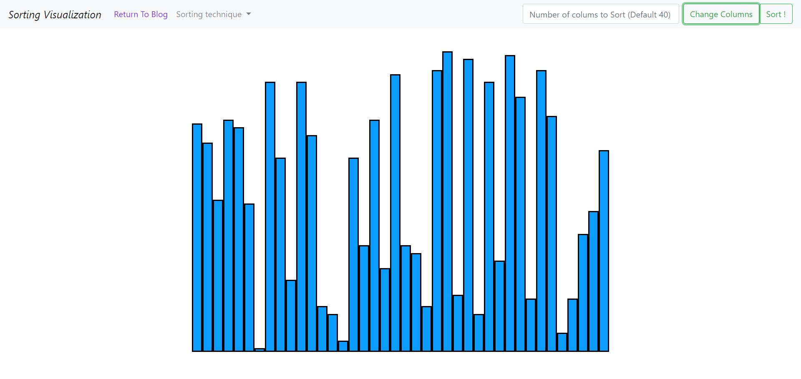

# Sorting Visualization
This is a visualization of some of the sorting algorihtms using vanilla javascript. It also displays the time of executing so that the complexities can be analyzed. :sparkles: 

## Here I have not implemented all the sorting algorithms :
- [x] Selection Sort
- [ ] Bubble Sort
- [ ] Merege Sort
- [ ] Quick Sort Sort

> Click [HERE](https://souptik2001.github.io/sort.html) to see the visualization *All sorting algorithms are implemented there*. 
